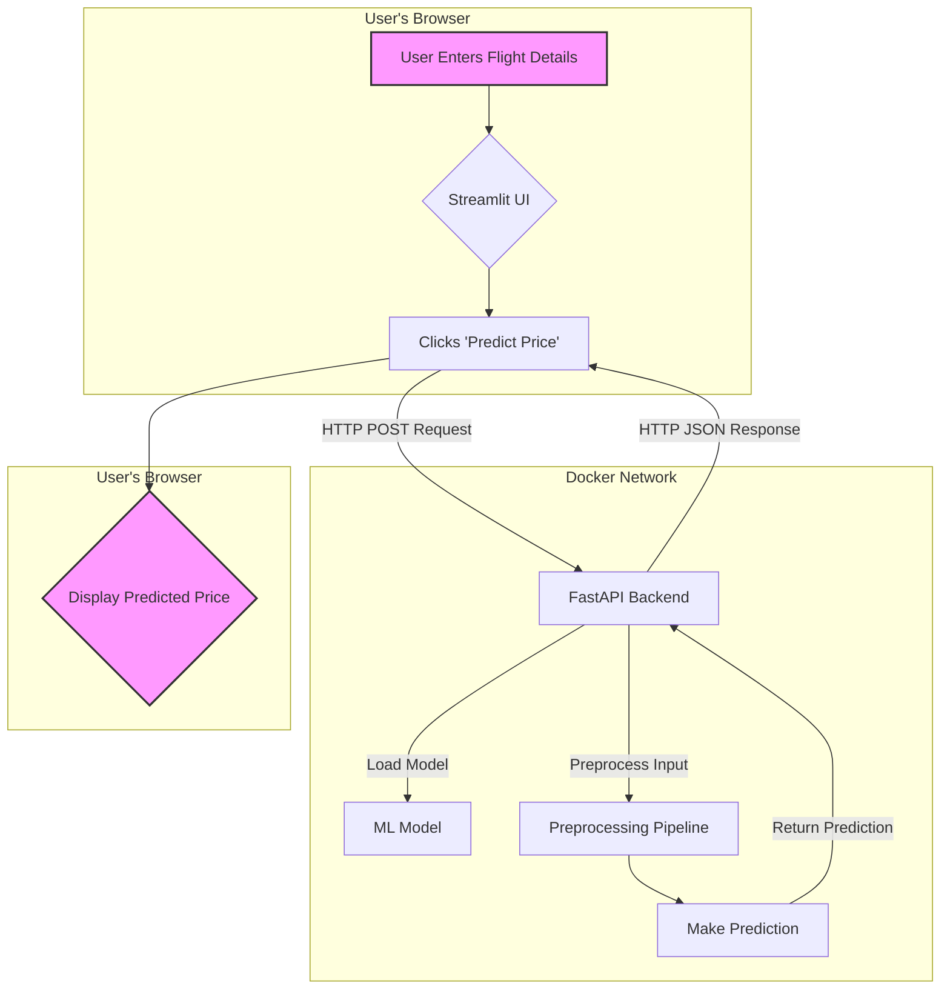

Flight Price Predictor API & Dashboard
An end-to-end MLOps project to predict flight prices, featuring a FastAPI backend, Streamlit UI, and Docker containerization.

Table of Content
Demo

Overview

Project Architecture

Tech Stack

Installation

Directory Tree

Bug / Feature Request

Future Scope

Demo
Here is a demo of the interactive Streamlit dashboard.

(Replace the path below with the actual path to your screenshot)

(You can add more screenshots here if you like)

Overview
This is a complete MLOps project to predict flight prices. It features a machine learning model served via a robust FastAPI backend and an interactive Streamlit dashboard for user interaction. The entire application is containerized with Docker for easy setup and deployment.

Project Architecture
This project follows a microservice-based architecture. The diagram below illustrates the complete workflow from user interaction to price prediction.



Tech Stack
Backend: Python, FastAPI, Scikit-learn, XGBoost

Frontend: Streamlit

MLOps & Deployment: Docker, Docker Compose, MLflow

Installation
Follow these steps to get the project running locally.

Prerequisites
Docker

Docker Compose

Setup
Clone the repository:

git clone [https://github.com/AmbujSinghNeo/Flight_Price_Prediction.git](https://github.com/AmbujSinghNeo/Flight_Price_Prediction.git)
cd Flight_Price_Prediction

Train the Model: Before running the application, you must train a model. The trained model artifact (.pkl) is required by the API.

```
## Navigate to the source directory
cd src

## Run the training script (this will create the model in src/model/)
python train.py

## Go back to the root directory
cd ..

```
Run the Application: Use Docker Compose to build and run the containers.

docker-compose up --build 

Access the Services:

Streamlit Dashboard: Open your browser to http://localhost:8501

API Docs: Access the interactive API documentation at http://localhost:8000/docs


API Usage
You can send a POST request to the /predict endpoint to get a price prediction.

Endpoint: http://localhost:8000/predict

Request Body:

```
{
  "airline": "Vistara",
  "source_city": "Delhi",
  "departure_time": "Morning",
  "stops": "one",
  "arrival_time": "Night",
  "destination_city": "Mumbai",
  "class": "Business",
  "duration": 15.83,
  "days_left": 26
}
```

Success Response:

{
  "predicted_price": 85000.50
}

Directory Tree
```
├── src
│   ├── model
│   ├── __init__.py
│   ├── config.py
│   ├── main.py
│   ├── preprocessing.py
│   ├── schema.py
│   ├── streamlit_app.py
│   ├── train.py
│   └── utils.py
├── tests
│   └── test_app.py
├── .gitignore
├── api.Dockerfile
├── Clean_Dataset.csv
├── docker-compose.yml
├── EDA_Flight_price.ipynb
├── mlflow.db
├── README.md
├── requirements.txt
└── streamlit.Dockerfile
```
Bug / Feature Request
If you find a bug or have a feature request, please open an issue on GitHub.

Future Scope
Implement a CI/CD pipeline using GitHub Actions for automated testing and deployment.

Add a batch prediction endpoint for CSV file uploads.

Secure the API with token-based authentication.

Monitor for data drift and set up automated model retraining triggers.